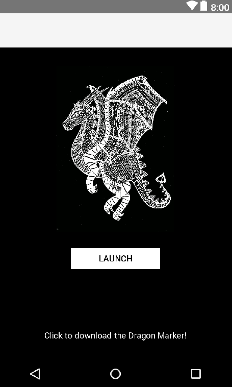

### Unity AR Dragon

   

A dragon is a large, serpent-like legendary creature that appears in the folklore of many
cultures around world. Beliefs about dragons vary drastically by region, but dragons in western cultures since the High Middle Ages have often been depicted as winged, horned, four-legged, and capable of breathing fire. Let's dive into making our virtual friend.

##### Pre-Requisite 

    Download the Unity Game Engine (https://unity3d.com/unity/download)

    Download Vuforia (https://www.vuforia.com/) Unity extension

##### Step 1:
Find an image as a marker. I just used a image of a dragon as it seemed most fitting to this project, but you can use any image you like. Please note that the image should have high contrast. This helps the camera identify the marker better.

##### Step 2:
Log into your Vuforia account, add your target image to target manager, give it a name and drag your picture in. Click the check box and download selected target database.
While we are here, open up your license manager and generate a “Development Key ”, we are going to need this later.

##### Step 3:
Find free 3D models for the tutorial - Unity AssetStore (https://www.assetstore.unity3d.com/#/)

##### Step 4:
Open Unity and import your marker and 3D model.

##### Step 5:
Add an AR camera by going to prefabs and then AR camera. Drag that into your scene.

##### Step 6:
Drag the image target into your scene.

##### Step 7:
Go to your AR camera. On the right in inspector, you'll see data set load behavior. Go ahead and load and then activate it.

##### Step 8:
Drag in your 3D model on to your image target and then hit run.

##### Step 9:
Define the animation.
